# Architecture review — `src-tauri/` (Rust core)

**Scope:** the Rust/Tauri 2 core only (`src-tauri/src/`, 148 files, 69,346 lines — ~38.8k
production, ~30.5k test). The React surface, `contract/`, `packaging/` and `scripts/` are
out of scope except where the core's boundary with them is the finding.
**Date:** 2026-08-24 · **Reviewed at:** commit `a3bb11c` on `feat/response-mode`
**Method:** static read of every module boundary, the state/locking model, the command
surface, the persistence and streaming hot paths, and the cross-domain reference graph.

---

## Verdict

This is a **well-disciplined codebase with a structural problem it has outgrown**.

The craft is genuinely above average: the security posture is tight, the lint policy is
argued rather than asserted, caps and timeouts are named constants with reasons, and almost
every non-obvious decision carries a comment explaining *why* — including the ones that are
admissions of debt. 1,475 tests across 127 modules is real coverage, and the `SessionEnv`
seam (`session/env.rs:24`) shows the team knows exactly what the right abstraction looks
like.

The problem is that **one module, `session/`, has become 61% of the core and sits in a
dependency cycle with six of its seven peers.** Rust does not reject intra-crate cycles, so
nothing in the toolchain catches this, and the conventions in `CLAUDE.md` ("group by
feature, no file over ~1000 lines") measure file size — a proxy the domain passes by
splitting files while the coupling underneath keeps growing.

Underneath that sit four concrete performance/correctness defects in the hot paths
(§F2–F5), each of which is a small, local fix. **Fix those first; they are cheap. Then
decide whether to break the cycle — that one is not cheap, and doing it before the next
provider lands is the difference between a two-week job and a two-month one.**

---

## 1. The architecture as it actually is

### 1.1 Shape

A single **binary crate**. `main.rs` (258 lines) is pure Tauri bootstrap: eight `.manage()`
state registrations, an ordered `.setup()` hook, a 124-entry command table, and an exit
handler that tears down seven categories of child process. That file is exemplary — it does
one thing, and every ordering constraint in `setup()` is explained.

Below it, ten feature domains as module directories plus nine cross-cutting leaf modules:

| domain | files | lines | share |
|---|---:|---:|---:|
| `session/` | 81 | 42,645 | **61.5%** |
| `extensions/` | 10 | 5,702 | 8.2% |
| `account/` | 10 | 5,348 | 7.7% |
| `project/` | 6 | 3,770 | 5.4% |
| `update/` | 6 | 1,956 | 2.8% |
| `shell/` | 4 | 1,841 | 2.7% |
| `permissions/` | 7 | 1,710 | 2.5% |
| `diff/` | 6 | 1,600 | 2.3% |
| `profiles/` | 5 | 865 | 1.2% |
| `editor/` | 3 | 623 | 0.9% |
| top-level leaves | 9 | 3,286 | 4.7% |

### 1.2 Runtime model

- **State:** eight independent `Mutex`-wrapped registries in Tauri managed state. A
  documented lock hierarchy makes `AccountState`, `UsageState`, `UpdateState` and
  `ExtensionState` *leaves* — nothing under them reaches back into `Engine.sessions`. That
  discipline is stated in `account/mod.rs:24`, `extensions/mod.rs:40`, `update/mod.rs:22`
  and `usage.rs:12`, and honoured at the call sites I checked.
- **Concurrency:** one OS thread per live turn (blocking NDJSON reader), plus 46
  `std::thread::spawn` sites across 26 files for watchers, probes, pollers and pumps. No
  pool, no `async` runtime of its own. 105 of 124 commands are `#[tauri::command(async)]`
  with *synchronous* bodies — a deliberate choice, argued at `diff/commands.rs:48-56`, to
  get blocking work off the Tauri main thread and onto runtime workers.
- **Provider seam:** `SessionAdapter` / `TurnControl` (`session/adapter/mod.rs:225-244`)
  with four implementations (Claude Code, Codex, Grok, and a Rust-native OpenAI loop),
  dispatched by a single `adapter_for(AgentRuntime)`. This is the cleanest boundary in the
  tree and it holds — there is **no** runtime branching outside `adapter/`.
- **Event bus:** three global Tauri channels (`session`, `agents`, `workflows`), each a
  tagged union broadcast to all windows; the webview filters by session id.
- **Persistence:** `sessions.json` written whole (temp + rename) at ~36 lifecycle points;
  transcripts appended line-by-line as NDJSON, one file per session.

### 1.3 Dependency graph

```mermaid
graph TD
    subgraph leaves["cross-cutting leaves (acyclic, healthy)"]
        ipc[ipc]
        pu[process_util]
        wsl[wsl]
        diag[diagnostics]
    end

    session[["session/<br/>42,645 lines · 81 files"]]
    account[account/]
    project[project/]
    profiles[profiles/]
    permissions[permissions/]
    diff[diff/]
    usage[usage]
    shell[shell/]
    extensions[extensions/]
    update[update/]
    editor[editor/]

    session <--> |70 / 30| account
    session <--> |23 / 1| permissions
    session <--> |20 / 1| diff
    session <--> |10 / 2| profiles
    session <--> |9 / 5| project
    session <--> |4 / 2| usage
    session <-.-> |via crate-root re-export| shell

    project <--> |1 / 1| account
    project <--> |1 / 1| profiles
    project --> permissions
    project --> diff
    account --> permissions
    profiles --> permissions
    update --> session
    editor --> session
    extensions --> pu

    session --> ipc
    session --> pu
    session --> wsl
    session --> diag

    style session fill:#8b2e2e,stroke:#c3f53f,stroke-width:3px,color:#fff
    style leaves fill:#1a3a2a,stroke:#4fae86
```

Arrows are `crate::<domain>` references. Bidirectional edges are cycles.



**Six cycles run through `session`, four more through `project`.** The `shell` edge is the
tell: `main.rs:29` re-exports `shell::dispose_session_shells` at the crate root purely so
`session` can call it "without depending on the shell module directly". That is a cycle
broken by aliasing rather than by inversion — the coupling is unchanged, only the import
path moved.

---

## 2. What is done well

These are load-bearing and should survive any refactor.

1. **The adapter seam is real.** Four runtimes, one dispatch function, zero leakage. Adding
   a fifth provider does not touch the engine, the commands, or any pane. `TurnControl`
   deliberately denies callers any way to name a `Child`, a `ChildStdin` or a pending map
   (`adapter/mod.rs:198-200`) — the encapsulation is enforced by the type, not by etiquette.
2. **Security defaults are correct and minimal.** Strict CSP with no `unsafe-eval` and no
   `unsafe-inline` on scripts, `frame-src`/`child-src`/`object-src` set to `'none'`,
   `base-uri`/`form-action` locked, `assetProtocol.scope: []` with the scope granted
   per-file at runtime, and a capability file listing eight permissions rather than a
   blanket default.
3. **The lint policy is argued, not asserted.** `Cargo.toml`'s `[lints]` block explains why
   it lives there instead of behind `-D warnings` in CI (flags after `--` are appended last
   and would silently re-deny every documented exception), and every `allow` carries the
   reason and the condition that would clear it. This is the rare case where the exceptions
   are more informative than the rules.
4. **Failure modes are thought about.** Atomic temp+rename for `sessions.json`; a panic hook
   that survives to disk; a `PERSIST_LOCK` because two writers share one temp path; a
   recompute coalescer (`diff/watch.rs:59-84`) that folds a burst of `tool.done` events into
   one in-flight plus one trailing git run; a `Condvar`-gated slot limiter for extension
   providers (`extensions/provider.rs:37`) — the only real backpressure in the tree.
5. **The `SessionEnv` trait is the right answer to the `AppHandle` problem**
   (`session/env.rs`). It exists specifically so a golden replay of a captured NDJSON stream
   is possible at all, and the doc comment names the exact bug that motivated it (a test that
   read the live `~/.claude` and failed on CI). See §F7 — the problem is that it was applied
   once.
6. **Backward compatibility is handled explicitly.** The omit-not-null convention for
   optional keys is stated at every write site, and `parse_agent_runtime_and_protocol`
   (`persistence.rs:430`) documents the read-side migration off a superseded key it will
   never write again.

---

## 3. Findings

Severity = (blast radius) × (likelihood) × (cost of fixing later). Each finding names the
evidence, the failure it produces, and the fix.

---

### F1 · HIGH · `session/` is a god-module in a six-way cycle

**Evidence**
- 42,645 lines / 81 files = 61.5% of the core, versus 8.2% for the next largest domain.
- Bidirectional `crate::` edges: `account` (70↔30), `permissions` (23↔1), `diff` (20↔1),
  `profiles` (10↔2), `project` (9↔5), `usage` (4↔2), `shell` (via the `main.rs:29`
  crate-root re-export).
- `session/mod.rs:65-99` glob re-exports **30 child modules** (`pub(crate) use adapter::*;`
  …), and 131 files in the tree open with `use super::*`. Every file under `session/` can
  therefore see every item of every other file under `session/`.
- Rust permits a child module to read its ancestor's private fields; `session/mod.rs:33`,
  `:44` and `:56` each cite this as the *reason* a module was made a child. So `Session`'s
  ~40 private fields are effectively public across a 42,645-line surface.

**Why it matters.** Module boundaries here are documentation, not enforcement. Nothing
prevents a new child from reaching into `Session`'s internals, and nothing in the toolchain
reports it when one does — Rust does not reject intra-crate cycles and clippy has no lint
for them. The consequence is already visible in the specs: `capability-registry` sits in
`draft` and depends on six domains at once, which is what a change looks like when the
boundaries do not hold.

**Fix.**
1. *Immediately (cheap, mechanical):* delete the 30 glob re-exports in `session/mod.rs` and
   replace them with named `pub(crate) use` lists. The compiler will then tell you exactly
   which child depends on which — today that information does not exist anywhere. Expect the
   first run to surface a few hundred names; that list **is** the module map you do not
   currently have.
2. *Next:* invert the six cycles by moving shared vocabulary down rather than the dependency
   across. `session→account` (70 refs) is almost entirely "which config dir / which kind" —
   that is an `AccountSnapshot` value type both domains can depend on. The `shell`
   re-export at `main.rs:29` should become a `SessionTeardown` trait the shell registry
   implements.
3. *Enforce it:* add a cycle check to `scripts/quality/conventions.mjs` — a ~40-line scan
   over `crate::<domain>` references that fails the build on a new back-edge, ratcheted the
   same way `oversized-baseline.json` is. Without enforcement this regresses within a
   quarter.

**Do not** attempt a full split into workspace crates as step one. The graph is too tangled
for that to be a mechanical change today; the named-export pass is the prerequisite that
makes it estimable.

---

### F2 · HIGH · `persist()` holds the global session lock across filesystem I/O

**Evidence** — `session/persistence.rs:251-349`

```rust
let _w = PERSIST_LOCK.lock().unwrap_or_else(|p| p.into_inner());
let map = engine.sessions.lock().unwrap();          // :257 — guard lives to end of fn
let list: Vec<Value> = map.values().map(|s| { … }).collect();
if let Some(path) = sessions_json_path(app) {
    let bytes = serde_json::to_vec_pretty(&list)…;   // :343
    std::fs::write(&tmp, &bytes)                     // :345  ← under the lock
    std::fs::rename(&tmp, &path)                     // :345  ← under the lock
}
```

The `MutexGuard` bound to `map` is never dropped before the I/O block, so the write and the
rename both execute while the whole session registry is locked.

**Why it matters.** `Engine.sessions` is the single mutex behind 69 lock sites, including
every turn reader thread and 124 commands. For the duration of two filesystem syscalls,
**every session in the app stalls** — streaming stops, commands queue, events back up. On a
synced or network-backed app-data directory (OneDrive, Dropbox, a roaming profile — all
common on the Windows target) `fs::rename` can take hundreds of milliseconds. The atomic
temp+rename is correct; holding the registry across it is not.

**Fix.** Two lines. Scope the guard so serialization ends before I/O begins:

```rust
let list: Vec<Value> = {
    let map = engine.sessions.lock().unwrap();
    map.values().map(|s| { … }).collect()
};   // guard dropped here
// … write + rename, no session lock held
```

`PERSIST_LOCK` still serialises writers, which is the invariant that actually needs holding.

---

### F3 · HIGH · O(n²) UTF-16 recount on every streamed token

**Evidence** — `session/stream/blocks.rs:229`

```rust
let offset = accum.encode_utf16().count();   // runs once per delta
accum.push_str(&text);
```

`accum` is the full text of the assistant block streamed so far. `encode_utf16().count()`
walks it end to end. This executes **once per token delta**, so producing a block of length
*n* costs Σ O(i) = **O(n²)** character traversals on the reader thread.

**Why it matters.** A 100 KB assistant response (routine for a long code block) streams in
roughly 25,000 deltas and burns on the order of 10⁹ character steps re-deriving a number it
already knows. This is per session, on the thread that is also parsing NDJSON and driving
every event the UI renders — the observable symptom is a response that visibly decelerates
as it gets longer, which is the worst possible shape for perceived latency.

Note the adjacent lock (`:235-240`): the comment correctly explains that the lock is held
only for the push. That analysis is right — but the expensive line is the one *above* the
lock, and it was measured as free.

**Fix.** Track the offset incrementally; it is a counter, not a derivation.

```rust
// alongside `text_accum`, keyed the same way
let off = utf16_offsets.entry(block_id.clone()).or_insert(0);
let offset = *off;
*off += text.encode_utf16().count();   // O(chunk), not O(accumulated)
```

O(n) total instead of O(n²), and the value is identical by construction.

---

### F4 · HIGH · Boot cost is unbounded: full transcript read + quadratic trim, on the main thread, under the global lock

**Evidence**
- `main.rs:104` — `session::load_persisted(app.handle())` runs inside `.setup()`, i.e. on the
  main thread before the event loop starts.
- `persistence.rs:662` — `let mut map = engine.sessions.lock().unwrap();` is taken **before**
  the per-session loop and held across it.
- `persistence.rs:245` — `read_transcript` does `std::fs::read_to_string(&path)`: the whole
  NDJSON file, however large, into memory.
- `persistence.rs:672` — `trim_transcript(&mut block_buffer, 400)` then discards all but the
  last 400 blocks.
- `transcript_cap.rs:26-35` — the trim is `blocks.remove(0)` in a loop. Each `remove(0)` on a
  `Vec` shifts every remaining element: **O(n²)** in the number of blocks discarded.

`transcript-scale` FR-3's stated goal is that "boot cost becomes `sessions × cap` rather than
paying each session's whole history in RAM." The implementation pays the whole history in RAM
*and* pays quadratically to throw it away.

**Why it matters.** A session with 50,000 persisted blocks costs ~1.2 × 10⁹ element moves to
trim, on top of reading and parsing the entire file — plausibly tens of seconds of a frozen,
unpainted window. And nothing bounds that number: **the on-disk transcript is never rotated,
compacted or truncated.** `append_transcript` (`persistence.rs:93-110`) only ever appends. The
RAM bound (400 blocks) has no disk counterpart, so this cost grows monotonically for the
lifetime of every session the user keeps.

**Fix**, in increasing order of effort:
1. `trim_transcript`: use `VecDeque::pop_front()`, or a single `blocks.drain(0..k)`. O(n)
   instead of O(n²). One line.
2. `read_transcript`: read the tail. The file is line-delimited, so seek to `len - K` bytes,
   discard the first partial line, and parse forward — bounded work regardless of file size.
3. Move `load_persisted` off `.setup()`: hydrate session *metadata* synchronously (cheap,
   `sessions.json` only) and stream transcripts in on a background thread, emitting
   `session.meta` as each lands. The window paints immediately.
4. Give the transcript file a retention policy — rotate at N MB, or compact to the last N
   blocks on clean shutdown. Today a year-old session is an unbounded disk and boot cost.

---

### F5 · MEDIUM-HIGH · A derived field is persisted and mutated independently of what derives it

**Evidence.** `AgentRuntime`/`ProviderProtocol` are documented as **derived** from the
account's kind at creation and never re-derived (`adapter/mod.rs:85-107`,
`session/mod.rs:499-506`). Two paths break that invariant:

- `session/mod.rs:1135-1144` — `clear_account()` repoints every session on a removed account
  to `default` and **leaves `agent_runtime` untouched**:
  ```rust
  .map(|s| { s.account_id = DEFAULT_ACCOUNT_ID.to_string(); s.meta() })
  ```
- `persistence.rs:714` vs `:718` — on load, `resolve_account` falls an unresolvable
  `accountId` back to `default`, while `agent_runtime: m.agent_runtime` is taken verbatim
  from the record.

**The failure.** Delete a Grok (or Codex, or endpoint) account with a live session on it. That
session now holds `account_id = "default"` — which `account::kind_of` (`account/mod.rs:373-376`)
hardcodes to `ClaudeCodeOauth` — while still holding `agent_runtime = Grok`. The next turn
routes through `adapter_for(Grok)`, spawns the `grok` CLI, and points `GROK_HOME` at the
built-in Claude config directory, which has no Grok credentials. The user sees an
authentication failure on a session they never changed, and the state is unrecoverable from
the UI: nothing re-derives the pair.

This is the same class of bug the codebase already fixed once and documented at
`account/mod.rs:346-360` — pointing `claude` at a Codex `CODEX_HOME` caused `claude` to
initialise it. The lesson was applied to the config-dir lookup but not to the runtime pair.

**Fix.** Pick one, but pick one:
- *Preferred:* stop storing the derived pair. Compute it from the account at every point of
  use — `AgentRuntime::from_account_kind(kind_of(app, &s.account_id))`. A derived value that
  is never stored cannot desynchronise; the persisted field becomes read-only legacy input.
- *If snapshot semantics are genuinely wanted* (the spec's FR-11a language suggests they might
  be): then a session's account is not reassignable across kinds, and `clear_account` must
  either refuse or set the session to `error` with an explanation, rather than silently
  producing an impossible pair.

Either way, add the invariant as a test: for every session,
`agent_runtime == from_account_kind(kind_of(account_id)).0`.

---

### F6 · MEDIUM · Per-session agent and workflow indices grow without bound

**Evidence** — `session/mod.rs:539-591`. A `Session` carries thirteen maps keyed by agent or
workflow id:

`agents`, `agent_order`, `agent_by_tool`, `agent_steps`, `agent_step_seq`,
`agent_inner_tools`, `agent_backend_ref`, `agent_blocks`, `agent_block_seq`,
`agent_blocks_dropped`, `workflows`, `workflow_order`, `workflow_by_tool`.

Across the entire tree, exactly one entry is ever removed from any of them
(`workflows.rs:455`, `workflow_scripts`). There is no eviction, no TTL, and no cap on the
number of agents.

The caps that do exist are **per agent**: `AGENT_TRAIL_CAP = 200` steps
(`session/mod.rs:252`), `AGENT_BLOCK_CAP = 400` blocks with an 8,000-char text cap
(`agent_transcript.rs:23-27`). The *number of agents* is unbounded.

**Why it matters.** Worst case per session is `agents × 400 blocks × 8 KB` ≈ **3.2 MB per
completed subagent**, retained for the life of the session. A session that runs a workflow
fanning out 50 agents holds ~160 MB of transcripts for agents that finished hours ago and
whose tabs are closed. The `transcript-scale` feature carefully bounded the session's own
buffer; the per-agent mirrors of the same data were not covered by it.

**Fix.** Bound the agent dimension the way the block dimension already is: keep full state for
the N most recent agents (`agent_order` already gives you first-seen ordering) and evict older
*completed* agents' `agent_blocks` / `agent_steps` / `agent_inner_tools` down to a summary —
the `AgentInfo` row is small and is what the roster renders. This mirrors `trim_transcript`'s
"stop at the oldest unsettled" rule exactly: never evict a running agent.

---

### F7 · MEDIUM · No library target — the core cannot be tested from outside itself

**Evidence**
- No `src/lib.rs`. The crate is `main.rs` only, so there is no public API and no second
  consumer.
- All 1,475 tests live in 127 `#[cfg(test)]` modules **inside** the binary.
  `src-tauri/tests/` does not exist.
- `AppHandle` appears in 128 function signatures across 68 files.
- The one place this was solved — `SessionEnv` (`session/env.rs:24`) — covers the NDJSON
  parse path and nothing else. Its own doc comment states the constraint plainly: *"this
  crate wires up no `AppHandle` test harness, so nothing reachable from a unit test may
  require a live one."*
- `adapter/mod.rs:340-343` is the visible cost: the `TurnContext` test can only assert the
  struct's *shape*, with a comment explaining that a real `begin_turn` call "needs an
  `AppHandle`, which cannot be built in a unit test."

**Why it matters.** Turn orchestration, spawn, and teardown — the highest-risk code in the
app, and the code four adapters now share — is structurally untestable. There is no
integration test level, no benchmark target (which is why F3 and F4 were never measured), and
no fuzz target for the NDJSON parser, which is the one place the core ingests untrusted
external bytes.

**Fix.** Split `lib.rs` out of `main.rs` — `main.rs` keeps `fn main()` and the command table,
everything else moves behind a library target. This is close to mechanical (the module tree
does not change, only the crate root) and immediately unlocks `src-tauri/tests/` and
`benches/`. Then widen `SessionEnv` from "what the parse path needs" to "what the engine
needs", and take `&dyn` at the ~30 orchestration entry points rather than at the ~128 leaves.

---

### F8 · MEDIUM · Four internal error representations, and 49 stringly-typed error codes

**Evidence**
- Internal fallible signatures, by frequency: `Result<T, String>` ×43,
  `Result<T, (&'static str, String)>` ×10, `Result<T, AppError>` ×8,
  `Result<T, (String, String)>` ×2.
- `IpcResult` (`ipc.rs:19-23`) is deliberately **not** a `Result` — it is an untagged serde
  enum for the wire. It therefore does not compose with `?`, which is why every one of the
  124 commands hand-writes a `match` ladder to convert.
- 49 distinct error-code **string literals** in the Rust source. The canonical union lives in
  TypeScript (`contract/common.ts:24`, 82 members).

**Why it matters.** The codes currently agree — all 49 diff clean against the union, which is
a credit to the team's discipline. But that agreement is maintained by hand across a language
boundary with no compiler, no test, and no lint enforcing it. A typo in a Rust literal
produces a code the frontend's `ErrorCode` type does not contain and `switch` does not handle,
and nothing fails. Meanwhile the four internal `Result` shapes mean every domain boundary is a
manual conversion, and each conversion is a place to lose a code.

**Fix.**
1. Define `enum ErrorCode` in Rust with `#[derive(Serialize)]` and one variant per member of
   the contract union. Make `AppError.code` that type. 49 literals become 49 compile-checked
   variants.
2. Add a test asserting the Rust enum's serialized names are exactly the TS union's members —
   parse `contract/common.ts` in a build script, or generate the TS from the Rust. Either
   direction; the point is that one of them is generated.
3. Standardise internal fallible code on `Result<T, AppError>` and give `IpcResult` a
   `From<Result<T, AppError>>`, so command bodies become `.into()` instead of a `match`.

---

### F9 · MEDIUM · 255 `.lock().unwrap()` on a panic-unwinding build: one panic can brick the app

**Evidence**
- 255 `.lock().unwrap()` sites; 69 of them on `Engine.sessions`.
- Only **2** sites tolerate poisoning (`persistence.rs:256` uses
  `unwrap_or_else(|p| p.into_inner())`); 32 more degrade gracefully via
  `let Ok(inner) = state.lock() else { … }`. The remaining ~220 panic.
- `[profile.release]` (`Cargo.toml`) sets `strip` and `lto` but **not** `panic = "abort"`, so
  panics unwind.
- `diagnostics.rs:46-70` installs a panic hook that logs and then delegates to the default
  hook — it records the panic, it does not contain it.

**Why it matters.** A panic on any of the ~46 background threads while holding
`Engine.sessions` poisons that mutex permanently. The next of 69 unwrapping call sites panics
too — and when that one is a Tauri command or the main thread, the app dies. A single
malformed frame from one provider's stream can therefore take down every session in the fleet.
The reader threads are exactly where untrusted external bytes are parsed, which is the worst
place for this property.

**Fix.** `Engine.sessions` is the one that matters. Wrap its acquisition in a helper that
recovers from poisoning — the state behind it is a `HashMap` of plain data, so `into_inner()`
on a poisoned guard is safe here in a way it would not be for an invariant-carrying type.
`Engine::with_session_mut` / `with_session` (`session/mod.rs:1046-1060`) already exist and are
documented as the standard shape for ~78 sites; make them poison-tolerant and push the
remaining direct `.sessions.lock()` sites through them.

---

### F10 · LOW-MEDIUM · Child-process spawning is a convention, not a facade

**Evidence**
- 58 `Command::new` sites across 20 files.
- `CLAUDE.md` states that "**every** child spawn goes through `process_util`'s login-shell
  PATH helper". Five files spawn with no `process_util` helper at all:
  `project/repo_brief.rs`, `session/adapter/openai/gate.rs`, `session/cloud/auth.rs`,
  `session/models.rs`, `update/helper.rs`.
- `session/adapter/openai/tools.rs:424-433` — the Francois-owned agent loop's `Bash` tool
  calls `no_window` but **not** `login_shell_path_env`. So a tool call carrying Claude Code's
  own name resolves binaries against launchd's minimal PATH under one runtime and the login
  shell's PATH under another. That is precisely the class of bug the `ext-path-resolution`
  feature was created to fix, reintroduced in a different runtime.
- `process_util.rs:1-3` documents that `session/mod.rs` still keeps a duplicate `no_window`.

**Why it matters.** Every spawn needs the same four things: PATH resolution, window
suppression on Windows, environment scrubbing, and stdio discipline. Applying them by
convention across 58 sites means the answer to "does this spawn behave like the others"
requires reading all 58.

**Fix.** A `process_util::spawn(program, args) -> CommandBuilder` that applies all four by
construction, plus a `conventions.mjs` rule that fails on a bare `Command::new` outside
`process_util`. ~150 lines, and it retires a whole category of "works on my machine".

---

### F11 · LOW · Five commands still run on the main thread, and two of them spawn processes

**Evidence** — sync `#[tauri::command]` (no `(async)`): `account_add_codex`,
`account_add_grok`, `account_codex_login`, `account_grok_login`, `account_install_cli`,
`app_dnd_state`, `workflows_list`.

`account_codex_login` (`account/commands.rs:704-745`) does `std::fs::create_dir_all` followed
by a process spawn — both on the main thread. `app_dnd_state` reads an OS-level state file (a
plist DB on macOS) on the main thread.

**Why it matters.** The rationale for making the other 105 commands `async` is documented at
`diff/commands.rs:48-56`: "a SYNC command runs on the MAIN thread (Tauri 2), where every git
spawn and every git-lock wait freezes the entire app." That reasoning applies unchanged to a
process spawn (10–100 ms on Windows) and to a filesystem read. These are the leftovers of a
migration that did not finish.

**Fix.** Add `(async)` to all seven. Their signatures are already compatible except where a
`State<'_, _>` parameter is borrowed — the fix for that is the same `app.state::<T>()` pattern
`diff/commands.rs` already uses and explains.

---

### F12 · LOW · `REPO_CACHE` never evicts

`diff/git.rs:177` — a process-lifetime `HashMap<String, (GitHost, String, Option<String>)>`
keyed by cwd, with no eviction and no invalidation. Bounded in practice by the number of
distinct directories a user touches in one run, so this is a slow leak rather than a bug — but
it is also stale-prone: a repo that is moved or re-initialised keeps its old answer until
restart. Sibling caches in the same subsystem (`GIT_LOCKS`, `RECOMPUTES`, `WATCHERS`) *are*
cleaned up, via `unwatch_session` (`diff/watch.rs:200-209`). Add the cwd key to that teardown.

---

## 4. Prioritised remediation plan

Effort in engineer-days, assuming familiarity with the codebase.

### Now — bugs with real user impact, all local (≈4 days)

| # | Finding | Change | Effort |
|---|---|---|---|
| 1 | **F2** | Scope the `MutexGuard` in `persist()` so I/O runs unlocked | 0.5 d |
| 2 | **F3** | Incremental UTF-16 offset counter in `handle_text_delta` | 0.5 d |
| 3 | **F4.1** | `trim_transcript`: `drain`/`pop_front` instead of `remove(0)` | 0.5 d |
| 4 | **F5** | Derive `agent_runtime` at point of use, or refuse the reassignment; add the invariant test | 1.5 d |
| 5 | **F11** | `(async)` on the seven remaining main-thread commands | 0.5 d |
| 6 | **F12** | Add `REPO_CACHE` to `unwatch_session` teardown | 0.5 d |

These are independent, individually shippable, and each is testable against the existing
suite.

### Next — capacity and boot, before the fleet gets bigger (≈7 days)

| # | Finding | Change | Effort |
|---|---|---|---|
| 7 | **F4.2/4.3** | Tail-read transcripts; move hydration off `.setup()` onto a background thread | 3 d |
| 8 | **F4.4** | Transcript retention policy (rotate or compact) | 1 d |
| 9 | **F6** | Evict completed agents' blocks/steps beyond the N most recent | 2 d |
| 10 | **F9** | Poison-tolerant `Engine.sessions` accessor; route direct locks through it | 1 d |

### Then — structure, before the next provider or `capability-registry` (≈15 days)

| # | Finding | Change | Effort |
|---|---|---|---|
| 11 | **F7** | Extract `lib.rs`; add `tests/` and `benches/` targets | 2 d |
| 12 | **F1.1** | Replace 30 glob re-exports with named exports — produces the real module map | 3 d |
| 13 | **F8** | `ErrorCode` enum + contract-parity test; standardise on `Result<T, AppError>` | 3 d |
| 14 | **F10** | `process_util::spawn` facade + conventions rule | 2 d |
| 15 | **F1.2/1.3** | Invert the `session↔account` and `session↔shell` cycles; add the cycle check to the quality gate | 5 d |

**Do #12 before #15.** The named-export pass is what makes the cycle work estimable — until
the globs are gone, nobody can enumerate what actually crosses each boundary, and any estimate
for #15 is a guess.

### Explicitly not recommended

- **Splitting into workspace crates.** Correct destination, wrong first step. Attempt it
  before #12 and #15 and the cycles turn into compile errors you cannot resolve without a
  rewrite. Revisit once the graph is acyclic.
- **Introducing `async`/`tokio` in the core.** The thread-per-turn model fits the workload (a
  handful of long-lived blocking streams), the blocking-body-on-`async`-command pattern is a
  sound adaptation, and converting 46 spawn sites and 58 process spawns would buy nothing the
  current model does not already deliver.
- **Paying down the file-size baseline for its own sake.** 15 files over 1,000 lines is a
  symptom of F1, not the disease. Fix the boundaries and the sizes follow; chase the sizes and
  you get more files with the same coupling.

---

## 5. One-paragraph summary

The Rust core is careful work with a good security posture, a genuinely clean provider
abstraction, and unusually well-reasoned comments — but 61% of it lives in one module that is
cyclically coupled to six of its seven peers, and the toolchain cannot see that because Rust
permits intra-crate cycles and the current quality gate measures file size instead. Four
independent hot-path defects (a global lock held across filesystem writes, an O(n²) recount
per streamed token, an O(n²) unbounded-input trim on the boot path, and a derived field that
desynchronises when an account is deleted) are cheap to fix and should be fixed now. The
structural work — extracting a library target, replacing 30 glob re-exports with named ones,
and inverting the two worst cycles — is roughly three weeks and should happen before the next
provider or `capability-registry` lands, because both will make it harder.
