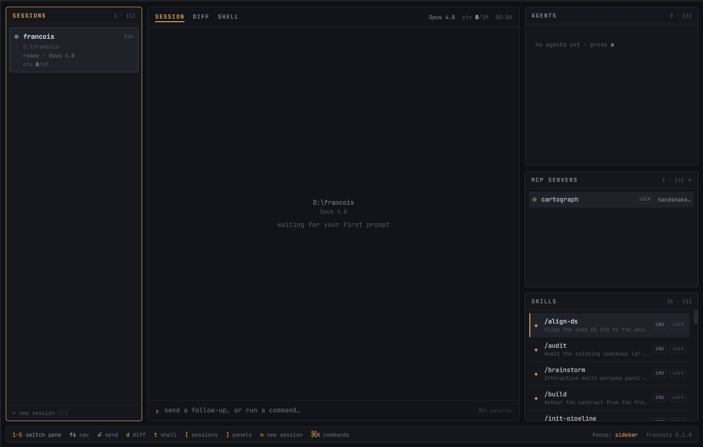

<div align="center">


# Francois

**Mission control for your Claude Code fleet.**

One window: every session, its transcript, its diff, its agents — and a real shell.

[](https://github.com/antoine-gmnz/francois/actions/workflows/release-main.yml)
[](https://github.com/antoine-gmnz/francois/releases/tag/dev)
[](https://github.com/antoine-gmnz/francois/releases)
[](#under-the-hood)
[](LICENSE)

</div>



## Why

[Claude Code](https://claude.com/claude-code) stopped being one terminal tab a long time ago. You've got a refactor running in one repo, tests being written in another, an infra change waiting for review in a third — and you're alt-tabbing between them like it's air-traffic control with sticky notes.

Francois turns that into an actual control room. It spawns and supervises multiple Claude Code sessions across project directories, streams their activity into a structured UI, and puts a **real terminal** next to the AI — so you never leave the window to run something yourself.

It's a **native desktop app** (Tauri 2: Rust core, system webview — no Electron), styled like the TUI it wishes it was: monospace, dark, keyboard-first, full mouse support.

## What you get

**⌗ The fleet board** — one status card per session: colour-coded state (pulsing while a turn runs), model, live context usage (`128.4K/1M`), an uncommitted-diff badge, running-agent count, and a last-activity clock. The state of every workstream, one glance.

**§ Structured transcripts** — not scraped terminal output. Francois drives Claude Code's `stream-json` interface, so user blocks, assistant text, tool calls (`⧉ Read`, `⌕ Grep`, `✎ Edit · +34 −19`), and subagent dispatches render as first-class blocks, streaming live.

**≡ A diff tab that commits** — per-session working-tree view: file selector with status glyphs and ±counts, windowed unified diff that stays snappy on 5k-line changes, stage-all and commit without leaving the app.

**❯ A real shell** — PTY-backed terminal per session (xterm.js + `portable-pty`), in the session's working directory. Not a toy console — your actual shell.

**⇉ The right rail** — live subagent progress, MCP server health (tool counts, handshakes, timeouts), and installed skills, per session.

**⌘K everything** — command palette with fuzzy matching: new session, switch model, run skill, attach MCP server, compact context, kill agent, toggle layout…

**⟳ Durable sessions** — quit, reopen, and your fleet is still there: transcripts, status, model, context usage. Sessions are resumable, not disposable.

**▯ A layout that gets out of the way** — `[` and `]` collapse the side columns when you want a full-width diff or transcript. Preferences persist.

## Keyboard

| Key | Action |
|---|---|
| `1`–`5` | Focus sessions / main / agents / mcp / skills |
| `↑` `↓` `⏎` | Navigate the focused pane · commit selection |
| `d` / `t` | Toggle DIFF / SHELL tab |
| `n` / `a` | New session / new agent |
| `/` | Filter sessions |
| `[` / `]` | Show/hide left / right column |
| `⌘K` / `Ctrl+K` | Command palette |
| `s` / `c` | Stage all / commit (in DIFF) |

## Install

**[⇓ Grab the latest dev build](https://github.com/antoine-gmnz/francois/releases/tag/dev)** — rebuilt on every push to `main`: Windows (`.exe`/`.msi`), macOS universal (`.dmg`, Apple Silicon + Intel), Linux (`.AppImage`/`.deb`).

> Builds are currently **unsigned**: on Windows, SmartScreen → *More info → Run anyway*; on macOS, right-click the app → *Open* (or `xattr -cr /Applications/Francois.app`).

**You need:**
- [Claude Code](https://claude.com/claude-code) installed and authenticated — `claude` must be on your `PATH` (Francois spawns it per session)
- `git` on your `PATH` (powers the DIFF tab)

### Build from source

```sh
# prerequisites: Node 20+, Rust stable, and the Tauri 2 platform deps
npm ci
npm run tauri dev     # run it
npm run tauri build   # produce installers
```

## Under the hood

- **Core**: Rust — session lifecycle, NDJSON event streaming from `claude -p --output-format stream-json`, PTY management, git via the system CLI. Heavy work stays off the UI thread.
- **Frontend**: React 18 + TypeScript (`strict`), zustand, xterm.js, plain CSS design tokens, JetBrains Mono.
- **Contract-first**: every frontend↔core payload shape lives in [`contract/`](contract/) — the Rust core mirrors it with serde. No stringly-typed IPC.
- **Spec-driven**: every feature ships from a frozen spec in [`specs/`](specs/), through an agent pipeline described in [`PIPELINE.md`](PIPELINE.md). The design reference lives in [`PROJECT.md`](PROJECT.md).
- **CI**: typecheck + vitest + cargo test on every PR; every push to `main` refreshes the rolling [`dev` release](https://github.com/antoine-gmnz/francois/releases/tag/dev) for all three OSes.

## Roadmap

- **Desktop notifications** — get pinged when a *background* session finishes, errors, or needs you ([spec](specs/notifications.md))
- **Session brake** — stop a running turn mid-flight, and opt-in `git worktree` isolation so a session's edits never touch your main tree ([spec](specs/session-brake.md))
- **`francois` CLI** — talk to the running app from any terminal ([spec](specs/cli-companion.md))
- **Expanded fleet board** — a full-window mission-control view for big fleets

## The name

Named after **Claude François** — the French singer with the immaculate choreography. He kept a stage full of Claudettes perfectly in sync; Francois does the same for a fleet of Claudes. *Comme d'habitude.*

## License

[AGPL-3.0](LICENSE) © 2026 Antoine Gimenez. Use it, study it, fork it — but if you distribute or host a modified version, your version must stay open under the same license.
