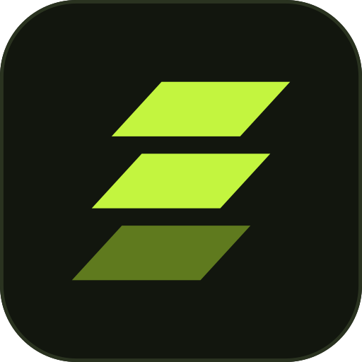
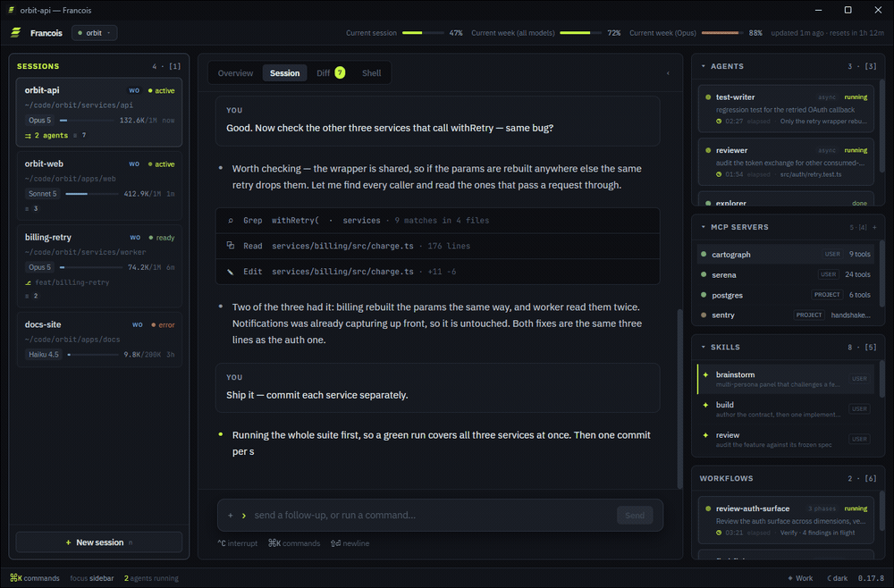
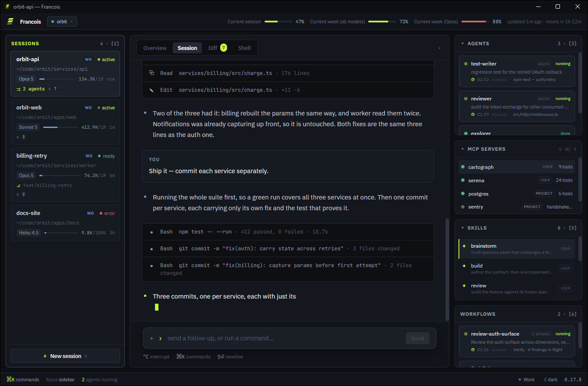

<div align="center">



# Francois

**Mission control for your Claude Code fleet.**

One window: every session, its transcript, its diff, its agents — and a real shell.

[](https://github.com/antoine-gmnz/francois/actions/workflows/release.yml)
[](https://www.npmjs.com/package/francois)
[](https://github.com/antoine-gmnz/francois/releases)
[](#under-the-hood)
[](LICENSE)

</div>



## Why

[Claude Code](https://claude.com/claude-code) stopped being one terminal tab a long time ago. You've got a refactor running in one repo, tests being written in another, an infra change waiting for review in a third — and you're alt-tabbing between them like it's air-traffic control with sticky notes.

Francois turns that into an actual control room. It spawns and supervises multiple Claude Code sessions across project directories, streams their activity into a structured UI, and puts a **real terminal** next to the AI — so you never leave the window to run something yourself.

It's a **native desktop app** (Tauri 2: Rust core, system webview — no Electron), styled like a console you'd actually want to look at: one acid accent reserved for the live thing, on cool greys, IBM Plex Sans for chrome and JetBrains Mono for everything that's code, a path, or a number — dark or light, keyboard-first, full mouse support.

## What you get



**⌗ The fleet board** — one status card per session: colour-coded state (pulsing while a turn runs), model, live context usage (`128.4K/1M`), an uncommitted-diff badge, running-agent count, and a last-activity clock. The state of every workstream, one glance.

**§ Structured transcripts** — not scraped terminal output. Francois drives Claude Code's `stream-json` interface, so user blocks, assistant text, tool calls (`⧉ Read`, `⌕ Grep`, `✎ Edit · +34 −19`), and subagent dispatches render as first-class blocks, streaming live.

**≡ A diff tab that commits** — per-session working-tree view: a collapsible **folder tree** with status glyphs, ±counts and a `/` filter box, word-level intraline emphasis so a one-character rename doesn't read as a whole red line beside a whole green one, a windowed unified diff that stays snappy on 5k-line changes, stage-all and commit without leaving the app.

**❯ A real shell** — PTY-backed terminal per session (xterm.js + `portable-pty`), in the session's working directory. Not a toy console — your actual shell.

**⇉ Agents, MCP, skills, workflows** — four views per session, opened from the roster's own rows or with `3`–`6`: live subagent progress `[3]`, MCP server health (tool counts, handshakes, timeouts) `[4]`, installed skills `[5]`, and running `Workflow` scripts — declared phases, live elapsed, completion `[6]`. Click an agent card, or a workflow run, to open its own transcript as its own tab.

**⌘K everything** — command palette with fuzzy matching: new session, switch model, run skill, attach MCP server, compact context, kill agent, rename a session, toggle layout…

**⌂ Projects, groups & the OVERVIEW tab** — register your repos once, get per-project session defaults, and a cross-project dashboard: fleet totals, what needs attention, per-project rollup, activity feed. Group several checkouts of the same product under one name and the sidebar roster gains a tier: group → project → session cards.

**◈ Session profiles** — save a way of working (system prompt, allowed tools, MCP set) as a named profile paired to a project, pick it when you spawn a session, and it's snapshotted onto that session for good. Manage them in a Profiles modal beside Projects, or from `⌘K`.

**⚇ Several accounts at once** — run more than one Anthropic account side by side, each with its own `CLAUDE_CONFIG_DIR`, logged in from inside the app through a real `claude` TUI. Pick one per session, or a default per project; the titlebar carries that account's plan meters and reset clock, and the status bar says which account the selected session runs on.

**⇱ Approvals, questions and attachments** — permission cards for gated tool calls (with a rules editor over Claude Code's own `settings.json`), `AskUserQuestion` cards, `/` command autocomplete, arrow-up message recall, and file/clipboard attachments in the composer (drop, paste a screenshot, or pick — Claude reads them off disk through its own tooling).

**⊞ Extensions** — teach Francois about the tools it doesn't ship with. Drop an `extension.json` in `~/.francois/extensions/` (`francois ext install`) and get a main-pane tab beside SESSION / DIFF / SHELL, fed by a command already on your `PATH` and rendered as tables, stat tiles, key-value lists or a live log tail. **No code, ever** — a manifest declares commands, and nothing runs until you've read them in the consent dialog and enabled it. Edit the manifest and it flips straight back off.

**⇄ Remote control** — hand a session to Claude Code's native Remote Control and keep the same thread going from your phone or claude.ai.

**⟳ Durable sessions** — quit, reopen, and your fleet is still there: transcripts, status, model, context usage. Sessions are resumable, not disposable. Optionally run one in its own `git worktree`.

**♪ Notifications you'll actually notice** — a desktop banner when a session is blocked on an approval or a question, or its turn lands — plus a short synthesized **tone** for the same two moments, so the cue reaches you when your eyes are on an editor and not on the corner of the screen. One toggle (`⌘K` → sound), throttled, silent under OS Do Not Disturb.

**▯ A layout that gets out of the way** — two chrome tiers do the talking (one for the app, one for the selected session), so the pane below is a bare surface; `[` folds the roster to a 46px rail. Up to four resizable session panes side by side, a measured ~680px reading column in the transcript, and a titlebar carrying the project switcher, your plan meters and the account. Theme and layout preferences persist.

## Keyboard

| Key | Action |
|---|---|
| `1` / `2` | Focus the roster / the main pane |
| `3`–`6` | Open agents / mcp / skills / workflows (again returns to SESSION) |
| `↑` `↓` `⏎` | Navigate the focused pane · commit selection |
| `d` / `t` / `o` | Toggle DIFF / SHELL / OVERVIEW tab |
| `w` | Close the active agent tab |
| `n` / `a` | New session / new agent |
| `x` | Kill the selected agent (in AGENTS) |
| `/` | Filter sessions (or skills in SKILLS, files in DIFF) |
| `←` `→` | Collapse / expand a folder in the DIFF tree |
| `[` | Fold the roster to its rail |
| `⌘K` / `Ctrl+K` | Command palette |
| `↑` `↓` | Recall previously sent messages (in the composer) |
| `s` / `c` | Stage all / commit (in DIFF) |

Single-key bindings stand down while you're typing in an input or the SHELL terminal has focus; `⌘K` always works.

## Install

```sh
npm i -g francois
```

Then open it from the **Start Menu, Launchpad or your applications menu** like any other app — or type `francois` in a terminal, whichever you prefer.

**No installer, and no security warnings.** SmartScreen and Gatekeeper key off the Mark-of-the-Web / `com.apple.quarantine` attribute that a *browser* attaches at download time — a binary fetched by npm never carries one, so the same unsigned build launches clean. No certificate, no *More info → Run anyway*, no right-click → *Open*.

It really is installed, not just a command on your `PATH`:

| | |
|---|---|
| **Windows** | Start Menu shortcut, and an entry in Settings → Installed apps |
| **macOS** | the app in `~/Applications`, found by Spotlight, Launchpad and the Dock |
| **Linux** | a `.desktop` launcher and icon under `~/.local/share` |

All per-user — no admin rights, no elevation prompt. The download is checked against a published sha256, and `npm uninstall -g francois` cleans up after itself.

Every push to `main` cuts a new version, so `npm i -g francois` is always the newest build — `npm update -g francois` to move up.

<details>
<summary>Or use the native installers</summary>

**[⇓ Grab the latest release](https://github.com/antoine-gmnz/francois/releases/latest)** — Windows (`.exe`/`.msi`), macOS universal (`.dmg`, Apple Silicon + Intel), Linux (`.AppImage`/`.deb`). Every version ever shipped is in [releases](https://github.com/antoine-gmnz/francois/releases).

> These are **unsigned**, and the browser download marks them: on Windows, SmartScreen → *More info → Run anyway*; on macOS, right-click the app → *Open* (or `xattr -cr /Applications/Francois.app`).

</details>

**You need:**
- [Node 18+](https://nodejs.org) — you already have it if Claude Code runs
- [Claude Code](https://claude.com/claude-code) installed and authenticated — `claude` must be on your `PATH` (Francois spawns it per session)
- `git` on your `PATH` (powers the DIFF tab)

### Build from source

```sh
# prerequisites: Node 20+, Rust stable, and the Tauri 2 platform deps
npm ci
npm run dev:app        # run it (dev identity — safe next to an installed Francois)
npm run build:app      # produce installers (stable identity: Francois)
npm run build:app:dev  # produce installers (dev identity: Francois Dev)
```

Dev and stable are separate apps (`com.francois.dev` vs `com.francois.desktop`) with
separate data directories — run both at once, sessions never collide.

## Under the hood

- **Core**: Rust — session lifecycle, NDJSON event streaming from `claude -p --output-format stream-json`, PTY management, git via the system CLI. Heavy work stays off the UI thread.
- **Frontend**: React 18 + TypeScript (`strict`), zustand, xterm.js, plain CSS design tokens (per-feature stylesheets, a shared UI kit, no inline styles), IBM Plex Sans + JetBrains Mono.
- **Contract-first**: every frontend↔core payload shape lives in [`contract/`](contract/) — the Rust core mirrors it with serde. No stringly-typed IPC.
- **Spec-driven**: every feature ships from a frozen spec in [`specs/`](specs/), through an agent pipeline described in [`PIPELINE.md`](PIPELINE.md). The design reference lives in [`PROJECT.md`](PROJECT.md).
- **CI**: typecheck + vitest + cargo test on every PR. Every push to `main` cuts a version — the next semver is derived from the conventional commits since the last tag, built for all three OSes, attached to a GitHub release (installers + installer-free archives), and published to the [`francois` npm package](packaging/npm). No manual step at any point.

## Roadmap

- **Session brake** — stop a running turn mid-flight ([spec](specs/session-brake.md))
- **`francois` CLI** — talk to the running app from any terminal ([spec](specs/cli-companion.md))

## The name

Named after **Claude François** — the French singer with the immaculate choreography. He kept a stage full of Claudettes perfectly in sync; Francois does the same for a fleet of Claudes. *Comme d'habitude.*

## License

[AGPL-3.0](LICENSE) © 2026 Antoine Gimenez. Use it, study it, fork it — but if you distribute or host a modified version, your version must stay open under the same license.
