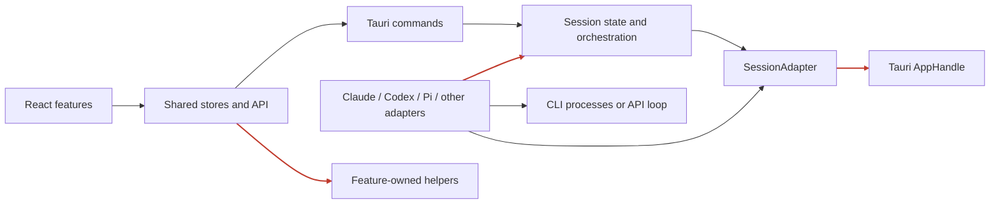
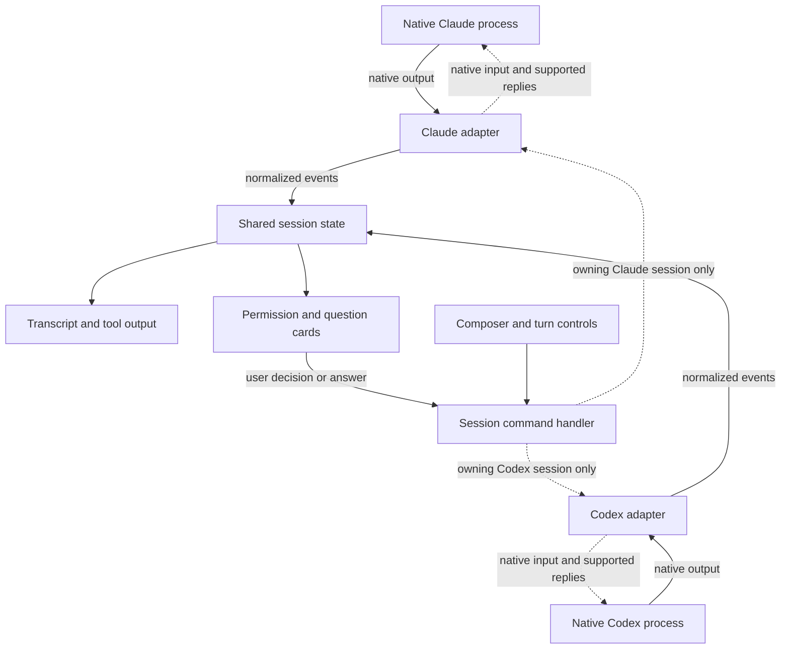

# Pi rollback and native-process architecture — task backlog

**Status:** implementation authorized; agents active · **Created:** 2026-09-21 · **Reviewed checkout:** `9441e6b`

Task15 enforcement + certification complete (specs/reports/process-architecture-validation.certification.md); authenticated live smoke remains open. The 16 tasks are dependency ordered. Tasks02–03 are implemented and independently reviewed; tasks05–07 are building,08–10 are frozen for their dependency handoffs. No release is claimed. See specs/reports/process-programme-status.md.

## Confirmed intent and missing source

The user now authorizes agents to implement the Pi rollback and architecture using `claude -p` and a native Codex process. The root agent orchestrates; surface agents implement. This supersedes proceeding
with the Pi integration programme.

The supplied [ChatGPT conversation](https://chatgpt.com/s/cx_6ab16c5253888191b015596bc2d34db5)
could not be fetched: browser retrieval failed and a direct request returned HTTP 403.
The user subsequently supplied the architecture sketch at
`.francois/attachments/0a513ecb/pasted-20260921-205417.png`, reviewed on 2026-09-21.
It shows native processes, provider adapters, a shared transcript and permission/question
responses returning to the processes. The revised flow below follows that sketch, with
the proposed arrow corrections identified explicitly. These tasks are grounded in the
repository, explicit instructions and sketch, **not a reconstruction of the conversation**.
Task00 records the confirmed diagram and explicit implementation assumptions. The missing conversation is an evidence limitation, not a blocker for independently specified work.

Working interpretation: Francois owns presentation, application orchestration, process
supervision and its session metadata; the native CLIs own reasoning, tools and native
conversation execution. No new Francois/Pi/SDK model-and-tool loop is planned.
Codex exec is preserved during rollback; task09 evaluates native App Server stdio for required bidirectional turns. Grok/Francois execution remains operational; no additional retirement was authorized. The sketch's example
adapter illustrates extensibility; it does not request a third runtime implementation.

## Existing work to preserve

| Existing implementation | Evidence | Treatment |
| --- | --- | --- |
| Runtime seam | `session/adapter/mod.rs`: SessionAdapter, TurnControl, TurnContext | Refine the existing seam; no second engine |
| Claude subprocess and control stream | `session/adapter/claude_code.rs`, `session/stdio.rs`, stream parser | Retain `claude -p` and its existing behaviors |
| Codex subprocess | `session/adapter/codex/{args,runner,wire,translate}.rs` | Reuse the shipped `exec --json` integration and thread resume |
| Codex models and account limits | `session/adapter/codex/{catalog,models,usage}.rs` | Keep the native App Server probes and caches |
| Codex commands and quotas added after Pi | `dcc95e2` (#144), `428463a` (#143) | Protect during selective rollback |
| Account login and profiles | `account/`, `profiles/`, project defaults | Preserve isolation and settings ownership |
| Persistence and recovery | `session/persistence.rs`, `persistence/sessions_file.rs` | Preserve atomic writes, quarantine and old data |
| Earlier architecture cleanup | `lib.rs`, `process_util.rs`, typed IPC errors, quality checks | Extend, do not redo or reverse |
| Existing frontend | Domain stores, transcript, roster, panes, capabilities | Adapt contracts, keep the product UI |
| Workspace services | Shell, git/diff, worktrees, extensions and notifications | Reuse independently of the agent runtime |

Rust paths in this table are relative to `src-tauri/src/`.

## Current architecture and targeted findings

The repository is a domain-organized modular monolith with shared IPC contracts and
runtime adapters. Useful seams already exist; the remaining problem is that application
policy, framework access and provider details still cross those seams.

Arrows show selected dependencies, not a full call graph. Red edges identify the
coupling this programme will address.

| Finding | Evidence and practical cost | Priority / confidence | Task |
| --- | --- | --- | --- |
| Runtime port requires framework context | `SessionAdapter::preflight/begin_turn/models` take `AppHandle`; adapters import session internals. Replacing transport still depends on app state and complicates headless lifecycle tests. | High / verified in code | 04–09 |
| Provider semantics sit in common orchestration | `session/turn.rs` handles Claude-shaped message/usage fields; `commands/lifecycle.rs` contains runtime-specific settings paths. Transport changes spill into generic lifecycle code. | High / verified in code | 05, 07 |
| Removing Pi crosses many shared boundaries | Four Pi commits touch contracts, settings, persistence, profiles, accounts, stores and presentation; #142 alone changes 255 files. A blanket revert risks unrelated changes and unreadable data. | High / verified in history and code | 01–03 |
| Shared frontend state imports feature-owned helpers | `src/lib/sessionsStore.ts` imports `features/agents/agent-tab`; the dependency map also flags shared-to-feature edges elsewhere. Moving a feature can force shared-state changes. | Medium / verified imports | 13 |
| Planning status does not reliably describe shipped code | The Codex interactive draft and old roadmap statuses coexist with later shipped command/catalog/usage changes. Blindly following the old programme duplicates work or promises unsupported controls. | Medium / verified code/history | 00, 09, 11 |

The architecture-review dependency script was run with output outside the repository.
Its static TypeScript component map is a navigation aid: aggregated cycles include
type-only edges and are not all runtime cycles. Rust boundary conclusions above come
from reading the traits, adapters, commands and persistence code. This is a targeted
review, not a complete audit or a claim that all existing tests pass.

## Runtime flow from the supplied sketch

This diagram shows runtime data/control flow, whereas the earlier diagram showed code
dependencies. The proposed shape is a native process behind its matching bidirectional
adapter, feeding shared session state and the transcript. User responses return through
that same adapter. Native reasoning/tool execution stays in the process.

Solid arrows show output and user actions; dashed arrows show the return path.
The two process boxes are runtime examples, not a decision to share one process across
all sessions. Concrete process lifetime remains task 00's decision.

Two arrow corrections to the supplied sketch are proposed:

1. Adapters are siblings: Codex does not feed another adapter. Each translates its own
   native protocol to/from the same application vocabulary. The IN/OUT diamond is
   per-process transport, not a separate agent or protocol-guessing dispatcher.
2. The transcript is a display projection. Permission/question cards may appear inside
   it, but pending requests belong to session state. Replies go through the session
   command handler and owning adapter, never directly from UI to process.

The thin session layer owns session/turn/request identity and whether a reply is still
valid. The adapter retains native request correlation and protocol encoding. Rendering
or replaying a card never executes a command. On a transport without native requests or
replies, the corresponding capability stays unavailable until supported and proven.

## Clean architecture rules for this flow

- Domain/application code depends inward on explicit values and ports. It does not
  import Tauri, provider wire schemas or concrete adapters.
- Provider adapters translate native events and controls; they do not mutate the
  engine through a framework service locator or import sibling provider adapters.
- Tauri is the delivery boundary around this flow; `main.rs` wires the existing
  adapters, process services and persistence. These are implementation boundaries,
  not additional steps in every conversation or a new agent harness.
- Existing domain modules remain the organizing convention. No repo-wide folder
  rewrite, universal base provider, event bus or new agent framework is required.
- Contract changes amend the current IPC domains; UI state consumes normalized events
  and honest capabilities, without decoding vendor protocols.
- Each extraction ships with preserved behavior and focused tests. Architecture checks
  prevent the dependency violations from returning.

## Sketch-to-task mapping

| Sketch element | Interpretation / proposed correction | Task |
| --- | --- | --- |
| Native process | Claude/Codex own agent execution; lifetime still to decide | 00, 06, 08, 09 |
| IN/OUT | Owned subprocess I/O, framing inside the matching adapter | 06, 08, 09 |
| Provider adapters | Independent bidirectional translators behind one application contract | 04, 08, 09 |
| Another example adapter | Extension point only, no third runtime work | 04 |
| Transcript | Shared projection of normalized session events | 07, 10, 13 |
| Permission ask / Questions | Shared request presentation and pending state | 05, 07, 11, 13 |
| Return arrows | Typed answer/decision routed to the originating session and native request | 05, 08, 09, 11, 15 |

## Tasks and dependencies

Tasks00–01 have documented decisions/inventories; 02–03 are building; 04 is a frozen ADR. Later implementation specs are prepared sequentially. Priority orders attention; only the dependency column defines
blocking edges. S/M/L are relative scope estimates, not delivery promises.

| # | Task | Priority | Owner | Depends on | Size |
| --- | --- | --- | --- | --- | --- |
| 00 | [Reconcile the supplied architecture and existing backlog](process-runtime-decisions.md) | P0 | lead | — | S |
| 01 | [Inventory Pi changes and protect unrelated work](pi-rollback-inventory.md) | P0 | lead + core + frontend | — | S |
| 02 | [Preserve stored data when Pi becomes unavailable](pi-retirement-data-compatibility.md) | P0 | core + frontend; lead owns contract | 01 | M |
| 03 | [Remove the active Pi integration selectively](pi-selective-rollback.md) | P0 | core + frontend; lead owns contract | 01, 02 | L |
| 04 | [Define clean application and runtime boundaries](process-runtime-boundaries.md) | P1 | lead + core | 00 | M |
| 05 | [Extract session orchestration from Tauri handlers](process-session-use-cases.md) | P1 | core | 03, 04 | L |
| 06 | [Consolidate subprocess ownership and cleanup](process-child-supervision.md) | P1 | core | 03, 04 | M |
| 07 | [Normalize events and apply session state deterministically](process-runtime-events.md) | P1 | core; lead owns contract | 03, 04 | M |
| 08 | [Adapt the existing Claude process integration to the boundary](claude-process-adapter.md) | P1 | core | 05, 06, 07 | M |
| 09 | [Complete the native Codex process integration](codex-process-adapter.md) | P1 | core | 05, 06, 07 | L |
| 10 | [Separate app persistence from provider conversation ownership](process-session-continuity.md) | P1 | core; lead owns contract | 08, 09, 07 | M |
| 11 | [Expose proven capabilities and native resources](process-native-capabilities.md) | P2 | core + frontend; lead owns contract | 08, 09 | M |
| 12 | [Preserve accounts, profiles, models and honest metrics](process-settings-and-metrics.md) | P2 | core + frontend; lead owns contract | 08, 09 | M |
| 13 | [Keep frontend state independent of runtime implementation](process-frontend-boundaries.md) | P2 | frontend; lead owns contract | 10, 11, 12 | M |
| 14 | [Reconcile legacy runtimes with the process-only target](legacy-runtime-scope.md) | P2 | lead + core + frontend | 00, 03, 08, 09, 10 | M |
| 15 | [Enforce boundaries and certify the migration](process-architecture-validation.md) | P2 | core + frontend + lead | 03, 13, 14 | M |

Sequence:

1. Reconcile source decisions (00) while inventorying Pi (01).
2. Deliver retirement-safe data handling (02), then selective Pi rollback (03).
3. Define boundaries (04); extract use cases, process supervision and events (05–07).
4. Migrate existing Claude/Codex adapters (08–09), then continuity, native capabilities
   and settings/metrics (10–12).
5. Complete frontend integration (13), apply explicitly decided legacy scope (14),
   then certify the result and enforce architecture rules (15).

Core and frontend agents implement disjoint surfaces concurrently. Subsequent batches wait for dependency evidence and frozen contracts.

## Rollback scope

| Pi change | Planning disposition |
| --- | --- |
| `2439d23` — #138 boundary/contracts | Selectively undo Pi additions; inspect shared improvements and unrelated configuration/UI hunks |
| `f13cfe7` — #139 installation/probing | Remove active Pi discovery/setup; retain shared spawn fixes only where needed |
| `4b9567b` — #140 RPC process | Remove Pi child/RPC ownership and unreachable transport scaffolding |
| `b2627f4` — #142 remaining Pi programme | Remove active Pi product flows; retain the minimal retired-data compatibility layer |

The pre-Pi reference is `82c093d`; it is an audit reference, not a reset target.
Keep current release manifests and all unrelated later commits. Preserve externally
owned Pi credentials, native conversations and installations. Historical specs may
remain as evidence with explicit supersession notes.

## Existing backlog reconciliation

- `core-architecture-fixes` / `core-architecture-wave3`: protect implemented module
  maps, error typing, spawn facade and quality rules; identify residual work precisely.
- `codex-model-catalog`: already implemented; reuse it.
- `codex-interactive-session`: reconcile with task 09 after selecting the transport.
  Shipped local interactive commands do not prove bidirectional native turn transport.
- `provider-effective-capabilities` / `capability-registry` / agent, MCP and workflow
  tasks: reconcile under task 11; no duplicate registry or custom tool loop.
- Model, settings, usage, input and continuity parity: reuse completed parts and
  re-scope remaining requirements under 08–13.
- Francois-loop and Grok parity: retain execution/data; task14 verifies compatibility because only Pi retirement is authorized.
- Pi-only deferred findings: supersede when their code is removed; retained shared
  code keeps its findings. A disappearing feature does not erase unrelated debt.

Tasks live in the repository and on the configured board. The Cohorte kanban helper succeeded during implementation preparation; earlier inference that no board was available was incorrect. Cards are moved through the helper as work progresses.

## Protocol evidence

The shipped source remains the starting point. Official documentation confirms that
Codex can emit JSONL through `exec --json` and also exposes a native bidirectional
App Server subprocess interface; both preserve Codex ownership of execution.
See [non-interactive mode](https://learn.chatgpt.com/docs/non-interactive-mode) and
[App Server](https://learn.chatgpt.com/docs/app-server), accessed 2026-09-21.
These references inform task 09; they do not select a transport on the user's behalf.
Supported-version captures and real-process validation remain implementation work.

