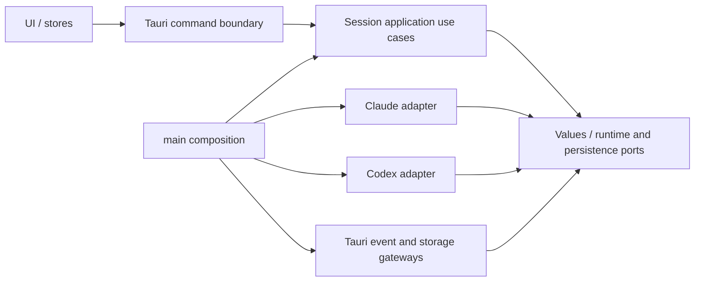

# 04 · Clean application/runtime boundaries

## 1. Summary

Refine the existing session adapter seam into inward-facing values/ports while retaining the domain-organized modular monolith. This is the binding architecture decision for tasks05–13, not a second agent engine.

## 2. Goals & non-goals

Application lifecycle/reduction runs without Tauri, subprocesses, logged-in accounts or filesystem. Adapters translate provider protocols and own process controls. No workspace/crate split, new async runtime, universal event bus, SDK/tool loop or repo-wide folder rewrite.

## 3. Flow and dependency rules

The native process output/control flow is bidirectional through its own adapter. Dependencies point inward; process output is normalized before application reduction and IPC publication. Pending requests belong to live session state, transcript is projection.

## 4. Functional requirements

- **FR-1** `session` remains the domain owner. Put pure request/state/error values and collaborators inside its existing module tree. No new top-level engine or duplicate SessionMeta/SessionEvent model.
- **FR-2** Refine existing SessionAdapter/TurnControl. Replace AppHandle parameters and adapter Engine lookups with explicit immutable turn context, normalized event/effect sink and injected account/process services at composition. Transitionally keep a bridge for unmigrated Grok/Francois; label it outer infrastructure and prevent application imports of it.
- **FR-3** Application code may use framework-free IPC error/value definitions and std synchronization, but may not import tauri, std::process handles, concrete adapters or vendor wire DTOs. Adapters cannot import another provider adapter. No adapter may acquire Engine through AppHandle after its migration completes.
- **FR-4** Existing command signatures stay compatible. Tauri handlers resolve dependencies, validate IPC shape and call use cases; business policy and asynchronous result validation move inward. Process I/O occurs after state locks are released.
- **FR-5** One immutable turn snapshot includes session/turn identity, cwd, account/runtime/home identity, model/effort/settings and native resume reference. Settings changes cannot alter a running snapshot. Application identity and native thread/request identity remain separate.
- **FR-6** Existing question/permission cards use session+block ids across IPC; application validates pending state/session/generation. Adapter retains vendor request ids. Duplicate/stale answers never write twice; closed channel produces cancellation/failure, not fabricated success. Durable transcript replay never reconstructs live ownership.
- **FR-7** Runtime event/effect reducer returns state changes and outward effects. Publishing/persistence executes outside reducer. Preserve existing transcript finalization, ordering, bounded buffers and unknown metrics. Provider parsers stay adapter-owned.
- **FR-8** Runtime/account/profile/process services are wired from existing main composition, not a global service locator. Actual module seams and tests are introduced incrementally by tasks05–09, then enforced by task15.

## 5. API contract

No IPC payload change. Existing `contract/common.ts`, session-engine.ts, session-questions.ts, permission-guardrails.ts and multi-provider-seam.ts remain canonical. `contract/process-runtime-boundaries.ts` re-exports the shared boundary vocabulary; Rust internal ports are not cross-surface IPC.

Keep TurnControl externally observed semantics: interrupt/kill, answer_question(blockId, answers), decide_permission(blockId, decision), pending counts/drain and pending permission-pattern lookup. Internal refactor must preserve existing ControlAck Applied/NotPending/ChannelClosed distinction until task05 explicitly enriches it. No new frontend API is required just to remove AppHandle.

## 6. Ownership / task mapping

Core owns runtime/application/ports, process_util and adapters. Frontend owns shared stores/projections/UI. Lead owns canonical contract changes. Task05 use cases; 06 process ownership; 07 normalized effects/reducer; 08 Claude migration; 09 native Codex bidirectional migration; 10 continuity; 11 capability/control evidence; 12 account/settings/metrics; 13 frontend dependencies; 15 enforce/report.

## 7. Errors / constraints

Keep existing typed errors at origin. New async results validate session/turn/generation before commit. Ambiguous native delivery is not auto-retried. Unsupported native capabilities stay honest but do not close required migration work without transport investigation.

## 8. Design

No visual change. Current transcript and request cards remain the UI contract.

## 9. Acceptance criteria

- [ ] A core use-case/reducer test runs with fake ports and no AppHandle/CLI/filesystem/account login.
- [ ] Application layer has no forbidden imports; migrated Claude/Codex adapters no longer call app.state Engine.
- [ ] Commands/card payloads stay compatible and requests cannot cross sessions/generations.
- [ ] No sibling adapter dependencies, second agent loop or duplicate event bus introduced.
- [ ] Architecture tests/ratchets and migration bridge removal are assigned to concrete subsequent tasks.

## 10. Readiness

READY as a binding ADR and incremental implementation scope. Task05/07 freeze concrete internal port signatures against post-rollback code before those implementation agents start; the architecture task is not claimed implemented merely because this file exists.

## Remediation
