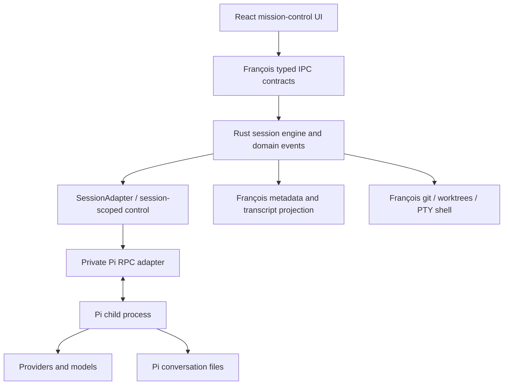

# Pi integration audit and architecture decision

Research date: 2026-09-18. Local working-tree audit; existing unrelated changes preserved.
Upstream repository: `earendil-works/pi`; inspected main revision
`bb0f4aa602f332838015ce66bdb0a94d8206dc93`. Downloaded package manifest: 0.85.1.
No real Pi runtime, provider account, or paid model request was executed during speccing.
Protocol fixtures and release compatibility remain certification work, not assumed facts.

## Current François boundary

The supplied brief's Claude-only premise is stale. The code has `claude-code`, `francois`,
`codex`, and `grok` runtimes. `AgentRuntime` already names an enum; do not introduce a
Rust trait with the same name. Extend `SessionAdapter` and `TurnControl` instead.

| Concern | Actual code / contract | Pi change |
|---|---|---|
| Product / stack | `README.md`, `PROJECT.md`, `PIPELINE.md` | Update marketing only at rollout; keep native Tauri/Rust/React |
| Runtime dispatch | `session/adapter/mod.rs`, `contract/common.ts`, `contract/multi-provider-seam.ts` | Add Pi, nullable provider wire dialect, live capabilities |
| Per-turn lifetime | `session/turn.rs`, `session/commands/lifecycle.rs`, `session/status.rs` | Separate Pi child lifetime from turn lifetime |
| Process / paths | `process_util.rs`, `session/spawn.rs`, `wsl.rs` | Use existing safe executable resolution and process cleanup |
| Claude stdio | `session/stdio.rs`, `session/control.rs`, `session/stream/` | Keep as Claude adapter internals; new private Pi codec |
| Durable state | `session/persistence.rs`, `session/mod.rs` | `sessions.json` and transcript JSONL; there is no database to migrate |
| Resume | `claude_session_id`, `turn.rs::is_resume_fail` | Pi-specific opaque reference; never fall back to a new conversation silently |
| Transcript | `session/blocks.rs`, `session/events.rs`, `contract/conversation-view.ts` | Generic complete tool/message state and ordered envelope |
| Frontend event flow | `src/lib/session-events.ts`, `sessionsStore.ts`, `useConversationTranscript.ts` | Keep one listener and frame-batched updates |
| UI transcript | `src/features/conversation/{Block,Composer,ConversationView}.tsx` | Generic tool details, notices, pending intent and partial output |
| Models | `session/models.rs`, `adapter/*/models.rs`, `ModelPicker.tsx`, `useModelCatalog.ts` | Pi-reported provider/model pair; no Claude fallback |
| Metrics | `session/turn.rs::ContextTracker`, `session/usage_probe.rs`, `usage.rs` | Separate usage totals from current context; no plan-meter invention |
| Accounts | `account/{mod,registry,login,mirror,cli_tools}.rs`, `contract/multi-account.ts` | Pi credential directory; do not mirror Claude credentials |
| Profiles | `profiles/{mod,parse,registry,commands}.rs`, `contract/session-profiles.ts` | Runtime-tagged configuration; no Claude argv in Pi |
| Projects | `project/`, `contract/projects.ts`, `contract/common.ts::ProjectDefaults` | Preserve single ownership of default model/account/effort |
| Skills / slash | `session/{skills,slash,interactive}.rs`, `src/features/skills/` | Pi `get_commands`; separate skill invocation from Claude installation |
| MCP / agents | `session/{mcp,agents,agent_transcript}.rs`, corresponding feature panels | Capability-disabled for baseline Pi |
| Permissions / questions | `permissions/`, `session/control.rs`, `contract/permission-guardrails.ts` | Never reuse Claude rules as an unenforced Pi permission mode |
| Workflows | `session/workflows.rs`, `workflow_watch.rs`, `workflow_details/` | Pi emits no equivalent workflow semantics by default |
| Remote / cloud | `session/remote/`, `session/cloud/` | Existing-runtime-only; no asserted Pi equivalent |
| Attachments | `session/attachments/`, `contract/session-attachments.ts` | Image content encoding inside adapter; retain core path validation |
| Shell / git | `shell/`, `diff/`, `session/worktree/` | Keep François-owned; no Pi RPC bash substitute for PTY |
| npm distribution | `packaging/npm/`, `.github/workflows/` | External Pi initially; keep zero-dependency launcher |

Core paths above are relative to `src-tauri/src/` unless stated otherwise.
Relevant existing specs read with contracts: `session-engine`, `durable-sessions`,
`session-brake`, `multi-provider-seam`, `session-profiles`, `transcript-perf`, `transcript-scale`.

## Architecture decision (validated 2026-09-18)

| Property | RPC child — selected | JSON/print child | SDK sidecar |
|---|---|---|---|
| Interactive commands | Bidirectional typed commands/responses | Batch-oriented prompt + output | Full SDK under an extra private transport |
| Streaming | JSONL events | JSON events | SDK callbacks to serialize |
| Stop / steering / follow-up | Explicit RPC verbs | No equivalent interactive stdin command contract | Exposed APIs, but bridge must implement lifecycle |
| Persistence | Pi session manager and file reference | Pi persistence, process-oriented lifecycle | Pi session manager through SDK |
| Models | RPC discovery / set_model | CLI options and one-shot listing | Registry access |
| Auth | Delegate to Pi interactive tooling/config | Same delegation | More API access, more secret handling responsibility |
| Packaging | External Pi executable | Same external dependency | Node/runtime + sidecar distribution and versioning |
| Windows/macOS/Linux | Pipe/framing + executable discovery fixtures required | Same spawn issues | Adds sidecar installation/runtime issues |
| Isolation | Pi child crash isolated from app | Same | Node child still required for Rust integration |
| Compatibility | Pin package; probe required commands | Less complete feature surface | Pin SDK and own private bridge compatibility |
| Observability / tests | Correlated commands, replayable stream, fake process | Easy batch captures, insufficient controls | Extra protocol and tests to maintain |
| Complexity | Fits current Rust process ownership | Smallest, fails interactive acceptance | Broadest access, unnecessary for MVP |

RPC wins because it covers the required loop and uses the existing process boundary.
The SDK remains an explicit future reconsideration if RPC cannot expose a necessary capability.
JSON/print is not the transport for interactive sessions.

## Verified Pi details and sources

- [RPC protocol](https://github.com/earendil-works/pi/blob/bb0f4aa602f332838015ce66bdb0a94d8206dc93/packages/coding-agent/docs/rpc.md): LF-delimited JSON; command IDs correlate replies, not ordinary events. Prompt acceptance is distinct from completion. `clear_queue` and `abort` are separate. `agent_settled` differs from `agent_end`. Images are base64 content; command listing omits TUI-only commands.
- [RPC implementation](https://github.com/earendil-works/pi/blob/bb0f4aa602f332838015ce66bdb0a94d8206dc93/packages/coding-agent/src/modes/rpc/rpc-mode.ts): model selection/listing uses the available model snapshot; no provider-login RPC verb. EOF follows shutdown cleanup. Do not invent `shutdown` as a wire command.
- [RPC types](https://github.com/earendil-works/pi/blob/bb0f4aa602f332838015ce66bdb0a94d8206dc93/packages/coding-agent/src/modes/rpc/rpc-types.ts): use typed command/result fixtures; optional/nullable fields remain distinct in the codec.
- [Session format](https://github.com/earendil-works/pi/blob/bb0f4aa602f332838015ce66bdb0a94d8206dc93/packages/coding-agent/docs/session-format.md): versioned JSONL tree, stable entry/parent IDs, v3 in this audit. Loading older files may migrate them. Pi is the writer.
- [SDK](https://github.com/earendil-works/pi/blob/bb0f4aa602f332838015ce66bdb0a94d8206dc93/packages/coding-agent/docs/sdk.md): Node/TypeScript embedding is an alternative, not needed inside React or Rust.
- [Provider authentication](https://github.com/earendil-works/pi/blob/bb0f4aa602f332838015ce66bdb0a94d8206dc93/packages/coding-agent/docs/providers.md): interactive `/login` and `/logout`, auth.json/environment/provider-specific resolution; configuration is not a successful network-auth check.
- [Auth storage](https://github.com/earendil-works/pi/blob/bb0f4aa602f332838015ce66bdb0a94d8206dc93/packages/coding-agent/src/core/auth-storage.ts): Pi owns credential writes and locking. François does not duplicate refresh logic.
- [Models](https://github.com/earendil-works/pi/blob/bb0f4aa602f332838015ce66bdb0a94d8206dc93/packages/coding-agent/docs/models.md): custom/local provider configuration can involve executable secret resolution. Reading a profile is not permission to execute its configuration.
- [Skills](https://github.com/earendil-works/pi/blob/bb0f4aa602f332838015ce66bdb0a94d8206dc93/packages/coding-agent/docs/skills.md): Pi owns skill loading and `/skill:name` expansion. A skill is instructions, not a sandbox boundary.
- [Extensions](https://github.com/earendil-works/pi/blob/bb0f4aa602f332838015ce66bdb0a94d8206dc93/packages/coding-agent/docs/extensions.md): arbitrary executable code and interception are possible; extension presence is not proof of enforced approvals or portable UI.
- [README / project trust](https://github.com/earendil-works/pi/blob/bb0f4aa602f332838015ce66bdb0a94d8206dc93/packages/coding-agent/README.md): RPC cannot ask the interactive project-trust question; global/default trust affects resources. Explicit launch policy must win over ambient trust.
- [CLI arguments](https://github.com/earendil-works/pi/blob/bb0f4aa602f332838015ce66bdb0a94d8206dc93/packages/coding-agent/src/cli/args.ts): `--no-extensions` disables discovery but explicit extension paths still load. Deny arbitrary extra args and never pass `-e` in MVP.
- [Package manifest](https://github.com/earendil-works/pi/blob/bb0f4aa602f332838015ce66bdb0a94d8206dc93/packages/coding-agent/package.json): audited identity is `@earendil-works/pi-coding-agent`, MIT, Node >=22.19.0. Verify the release artifact separately; do not reuse François README's Node 18 assumption.

## Ownership and enforcement

Pi owns conversation/context/session tree, provider calls, compaction, and credentials.
François owns project/account references, cwd/worktree, profile snapshot, labels, child
supervision, typed domain projection, UI queues, and transcript rendering.
François may read Pi entries to rebuild its disposable projection but never edits the tree.

| Boundary | Actual MVP guarantee |
|---|---|
| Tools / destructive commands / network | Pi runs with its process user's permissions; no per-tool approval or network sandbox claimed |
| Project filesystem | cwd chooses a working directory, not confinement; access outside it remains possible |
| Child lifecycle | Track process tree; stop/exit cleanup; platform limitations reported from observed evidence |
| Credentials | Pi-owned files/config; no keys in François account/session JSON, logs or IPC responses |
| Environment | Explicit profile environment; remove cross-runtime credential overrides; no environment dump |
| Extensions | Disabled discovery, no explicit loading, no automatic package installation by François |
| Project resources | Untrusted by default; explicit per-session project-resource choice before launch |
| Webview | Existing CSP/asset scope; sanitize before IPC, render text rather than executable tool output |
| Logs / transcripts | No raw RPC logging; redact credential fields/known secret patterns; user-authored secret text cannot be universally detected |

## Open evidence and product review

No freeze should claim a live capture exists. A certified package must prove required RPC
verbs/events, no extension execution under the launch policy, queue consumption identity,
Windows/npm launcher behaviour, process-tree cancellation, and session recovery.
Package size for managed/bundled variants is unmeasured; those distribution options are deferred.
The user validated coexistence, external Pi over RPC, Pi-owned credentials/history, and
disabled arbitrary extensions on 2026-09-18. The specifications are frozen with those
choices; real protocol captures and platform guarantees remain implementation acceptance gates.
